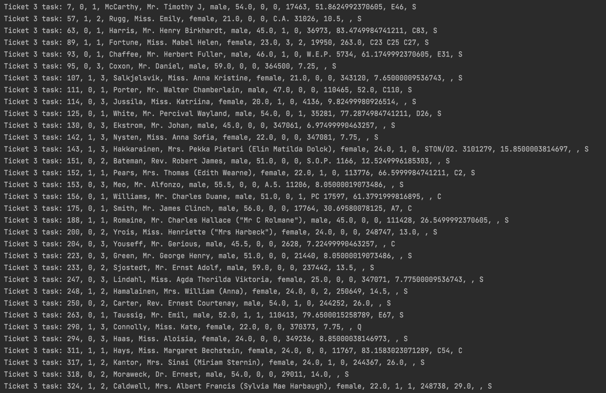
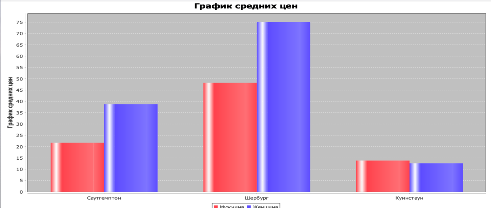

1. Выбрала свой вариант задания согласно номеру в таблице. Мой вариант: 3

2. Разработала набор классов с необходимым составом полей и методов 
для хранения и обработки всех данных, хранящихся в CSV-файле 3 варианта.(ParseDataAndCreateMainDB)

3. Распарсив данные в файле CSV, создала набор объектов, заполнив все необходимые поля.(Passenger.java)

4. Создала файл БД SQL Lite и подключила ее к проекту.(titanic)

5. В БД создала набор таблиц (по 3-ей нормальной форме) согласно набору объектов.

6. Все данные из набора объектов сохранила в БД.

7. Сделала набор SQL-запросов к БД согласно своему варианту задания.

8. Полученные данные вывела в текстовом виде в консоль, сделала скриншоты всех полученных данных.

2ое задание:

3е задание:

9. Числовые данные по заданию визуализировала в виде диаграмм, сделать скриншоты всех полученных данных.

10. Для проекта создала открытый репозиторий на github и закоммитила туда всю работу по проекту.

11. В файле README описала последовательность работы по своему проекту, а также прикрепила все скриншоты.